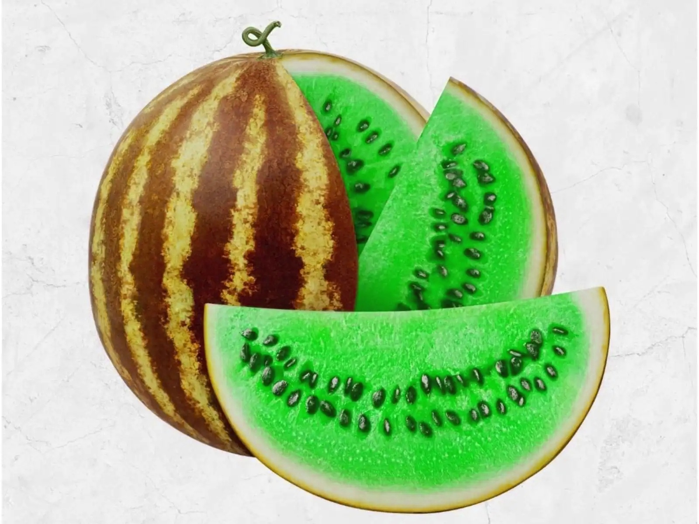

# ASSIGNMENT 9

## Installation
Run this command in terminal.
```
pip install -r requirements.txt
```

## Usage
### rgb2gray.py
By running this code, you can convert rgb image to gray image.


### materwelon.py
By running this python file, convert watermelon to materwelon image





### microsft.py & microsoft2.py
create microsoft banner


### rainbow.py
create a colorful rainbow from scratch


### rubik.py
run this file to solve the rubik's cube.


